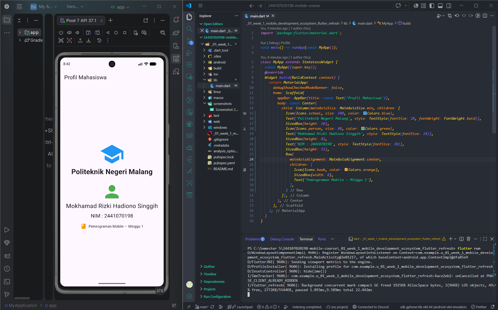

# _01_week_1_mobile_development_ecosystem_flutter_refresh

# Laporan Praktikum Minggu 1: Ekosistem Pengembangan Mobile & Flutter Refresh

**Nama:** Mokhamad Rizki Hadiono Singgih
**NIM:** 2441070198
**Mata Kuliah:** Pemrograman Mobile
**Lokasi:** Politeknik Negeri Malang

---

## Mini Assignment: Modifikasi Profil Mahasiswa
Aplikasi telah dimodifikasi menampilkan profil dengan penambahan komponen sesuai instruksi.

### Fitur Utama:
1. Nama: Mokhamad Rizki Hadiono Singgih
2. NIM: 2441070198
3. Informasi Tambahan: Politeknik Negeri Malang (dengan ikon).
4. Widget: Menggunakan `Row` untuk menyejajarkan teks dan ikon di tengah layar.

### Implementasi Kode (`lib/main.dart`):
```dart
import 'package:flutter/material.dart';

void main() => runApp(const MyApp());

class MyApp extends StatelessWidget {
  const MyApp({super.key});

  @override
  Widget build(BuildContext context) {
    return MaterialApp(
      debugShowCheckedModeBanner: false,
      home: Scaffold(
        appBar: AppBar(title: const Text('Profil Mahasiswa')),
        body: const Center(
          child: Column(
            mainAxisSize: MainAxisSize.min,
            children: [
              Icon(Icons.school, size: 100, color: Colors.blue),
              Text('Politeknik Negeri Malang', style: TextStyle(fontSize: 28, fontWeight: FontWeight.bold)),
              SizedBox(height: 20),
              Icon(Icons.person, size: 80, color: Colors.green),
              Text('Mokhamad Rizki Hadiono Singgih', style: TextStyle(fontSize: 24)),
              SizedBox(height: 8),
              Text('NIM : 2441070198', style: TextStyle(fontSize: 20)),
              SizedBox(height: 15),
              Row(
                mainAxisAlignment: MainAxisAlignment.center,
                children: [
                  Icon(Icons.book, color: Colors.orange),
                  SizedBox(width: 8),
                  Text('Pemrograman Mobile — Minggu 1'),
                ],
              ),
            ],
          ),
        ),
      ),
    );
  }
}
```

### Bukti Visual:
* **Desain Awal:** 
* **Verifikasi Perangkat:** 
* **Hasil Modifikasi:** 


## Penjelasan dan Pemecahan Masalah

### Hot Reload vs Hot Restart
* **Hot Reload (⚡):** Sangat cepat. Memperbarui UI seketika tanpa menghapus data sementara (*state*).
* **Hot Restart (🔄):** Agak lama. Me-restart aplikasi dari awal, sehingga semua data sementara (*state*) terhapus.

### Kendala Setup & Solusi
**Kendala:** HP iQOO Z10 terbaca di terminal namun berstatus `unauthorized` (pop-up izin USB debugging tidak muncul di HP).
**Solusi:** Saya mencobanya lagi menggunakan kabel USB yang berbeda kemudian pop-up izin USB debugging muncul di HP

## Jawaban Refleksi

**1. Kapan native lebih tepat daripada cross-platform?**
Saat aplikasi butuh performa maksimal (misal: game berat) atau butuh akses mendalam ke hardware HP (sensor khusus, kamera tingkat lanjut).

**2. Hubungan state dengan widget tree dan UI deklaratif?**
Di Flutter (UI Deklaratif), tampilan adalah cerminan dari data (*state*). Jika *state* berubah, Flutter otomatis menggambar ulang (*rebuild*) widget yang terkait saja, tanpa perlu kita ubah elemen UI-nya satu per satu secara manual.

**3. Manfaat commit kecil dengan pesan jelas?**
Sangat memudahkan pelacakan *bug* dan mencegah bentrok kode (*conflict*) saat kerja tim. Di portofolio, ini menunjukkan cara kerja developer yang rapi dan terstruktur.