# Laporan Praktikum Week 2: Declarative UI & Responsive Design

**Nama:** MOKHAMAD RIZKI HADIONO SINGGIH
**NIM:** 244107020198
**Kelas:** TI-3G - Pemrograman Mobile

---

## 1. Eksperimen Warm-up (Profile Card)
Di bagian awal ini, saya membuat *profile card* sederhana menggunakan kombinasi widget `Container`, `Column`, `Row`, dan `Expanded`. Dari beberapa eksperimen yang dicoba, ini hasilnya:
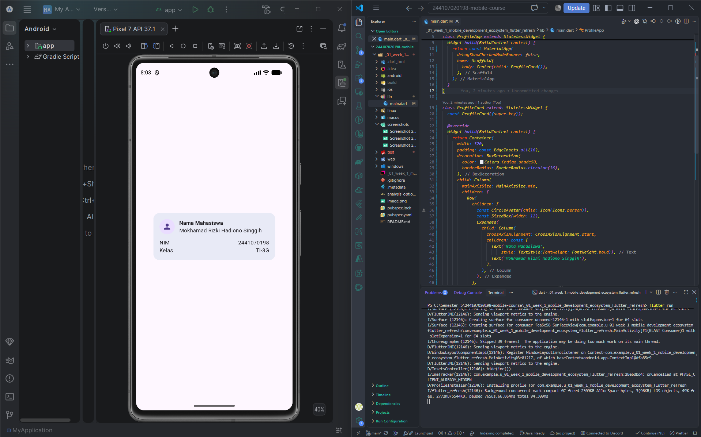

*   **Eksperimen 1:** Saat widget `Expanded` dihapus pada teks nama, muncul peringatan *RenderFlex overflowed*. Ini terjadi karena teksnya kepanjangan dan memakan ruang melebihi batas lebar maksimal `Container`.
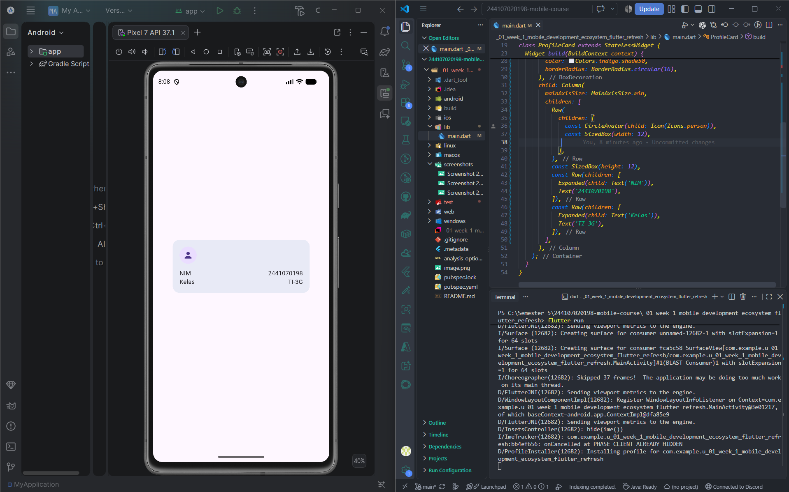

*   **Eksperimen 2:** Waktu nilai `mainAxisSize` diubah kembali ke default (`max`), *background* kartu malah melar memanjang ke bawah menutupi seluruh layar vertikal.
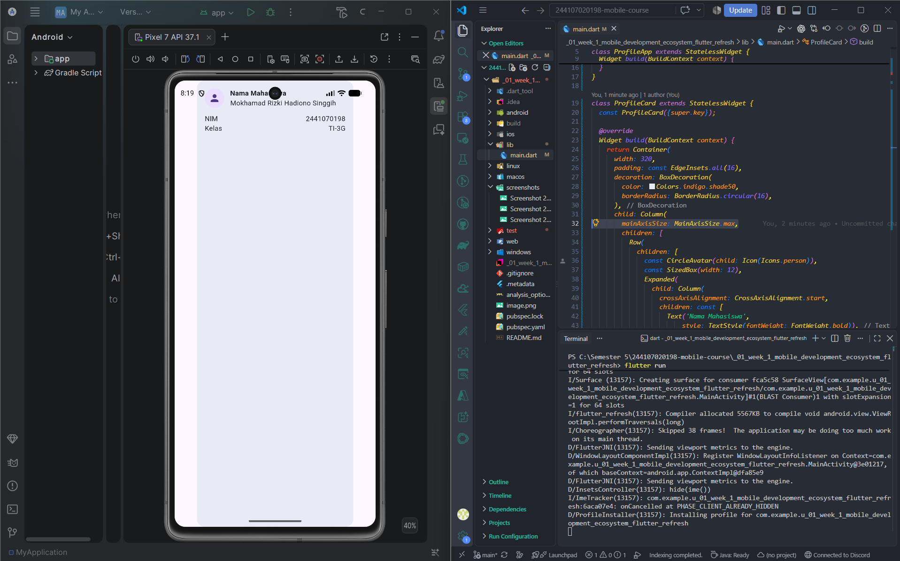

*   **Eksperimen 3:** Saya menambahkan baris "Email" menggunakan pola `Row` + `Expanded` yang sama, dan teksnya berhasil sejajar dengan rapi ke arah kanan.
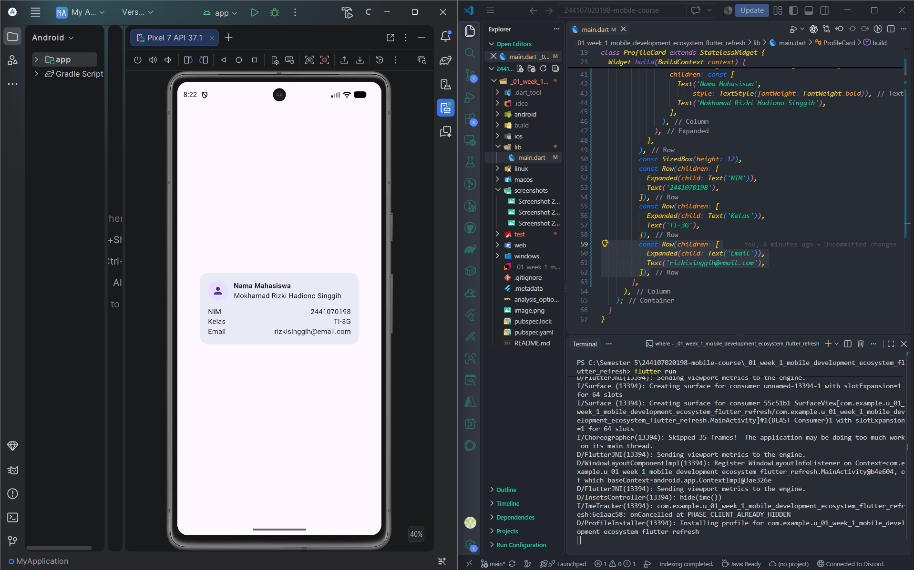


---

## 2. Praktikum: Dashboard Responsif Dasar
## Eksperimen Layout
Berikut adalah hasil pengamatan dari 4 eksperimen layout yang telah dicoba pada file `lib/main.dart`:
*   **Menyiapkan project:** 
     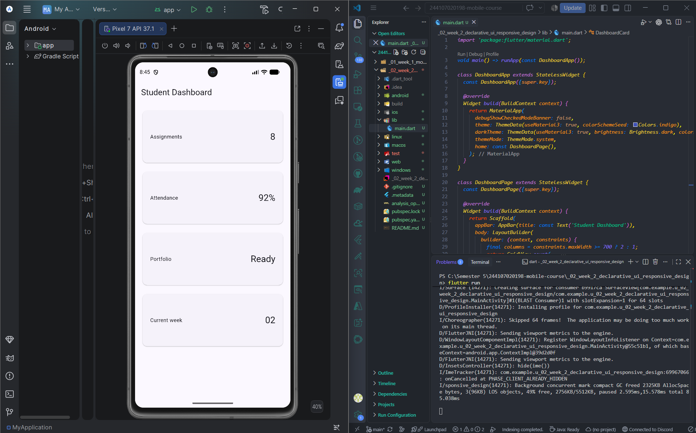

*   **Menambahkan interaksi: StatefulWidget dan Cupertino:** 
     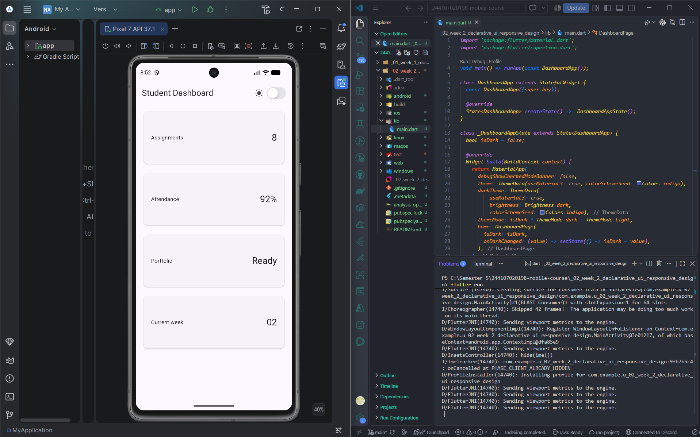
     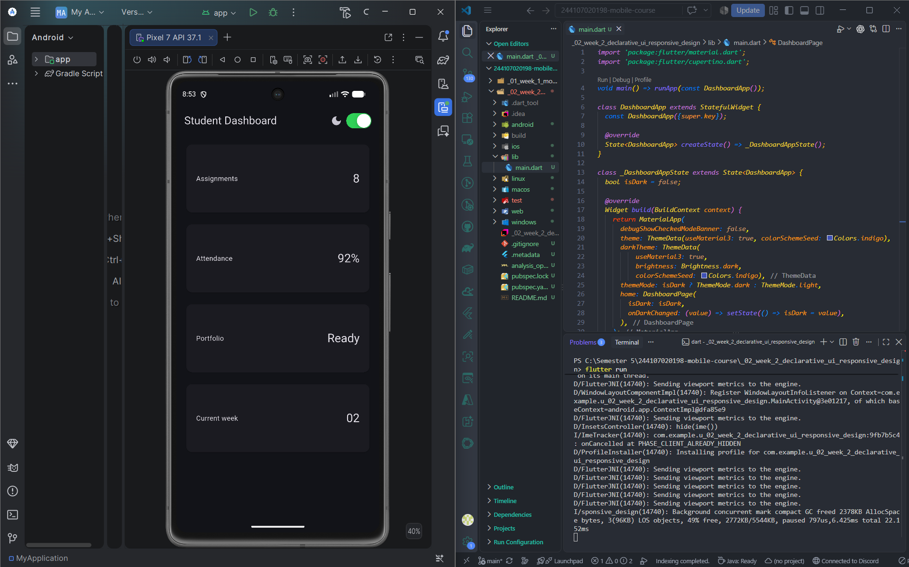

*   **Eksperimen 1 (Mengubah Breakpoint):** 
    Mengubah angka `700` menjadi `400` membuat grid lebih cepat berubah menjadi 2 kolom saat layar berada di posisi mendatar (*landscape*), karena lebar layarnya sudah melewati batas 400px. Setelah diamati, nilainya dikembalikan menjadi `700`.
    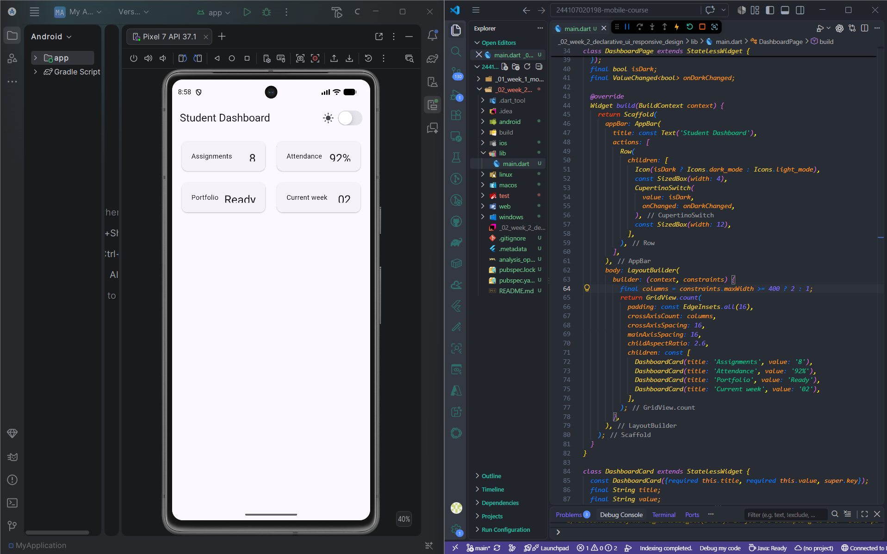

*   **Eksperimen 2 (Mengubah ThemeMode Secara Manual):** 
    Mengubah `themeMode` menjadi `ThemeMode.dark` secara *hardcode* membuat aplikasi terkunci dalam mode gelap secara permanen meskipun tombol *switch* digerakkan. Setelah dicoba, kodenya dikembalikan ke `themeMode: isDark ? ThemeMode.dark : ThemeMode.light` agar fungsi *switch* kembali normal.
    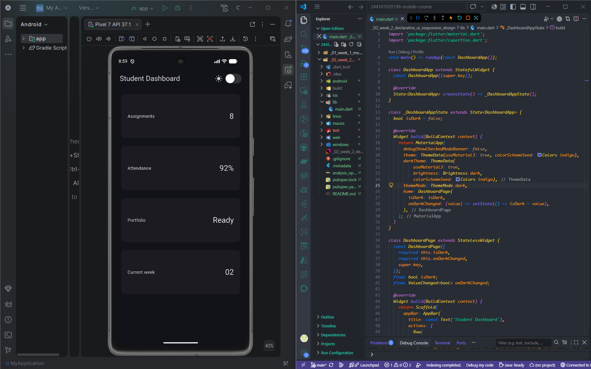

*   **Eksperimen 3 (Menguji Ukuran Layar Berbeda):** 
    Menguji perubahan ukuran jendela aplikasi membuktikan bahwa susunan `DashboardCard` otomatis berubah dari 1 kolom ke 2 kolom ketika melewati batas *breakpoint* (responsif).

    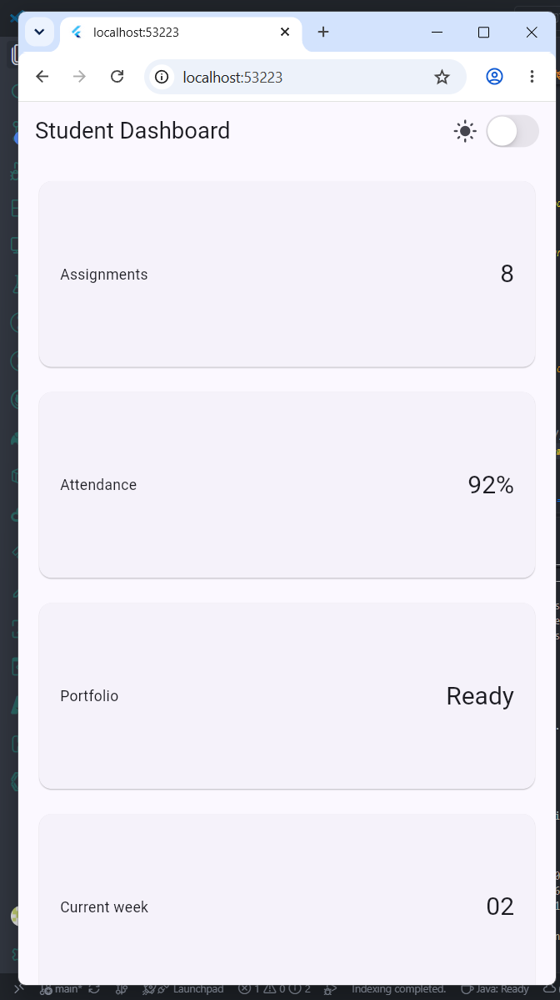
    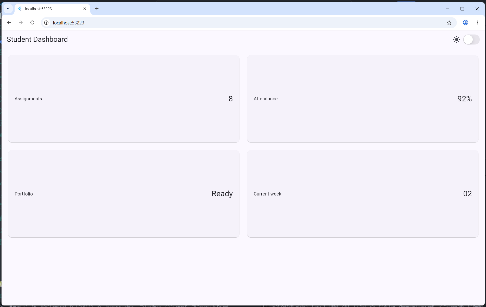
    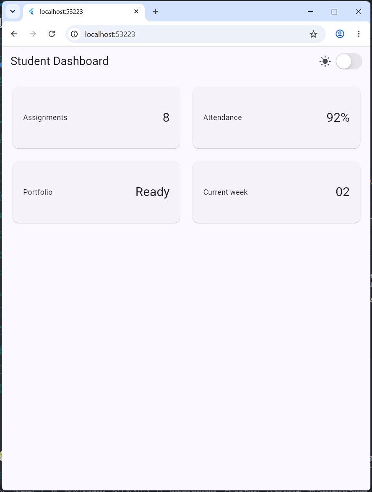

*   **Eksperimen 4 (Menambahkan Semantics):** 
    Membungkus `CupertinoSwitch` dengan widget `Semantics` untuk memberikan label aksesibilitas bagi *screen reader* (pembaca layar):
    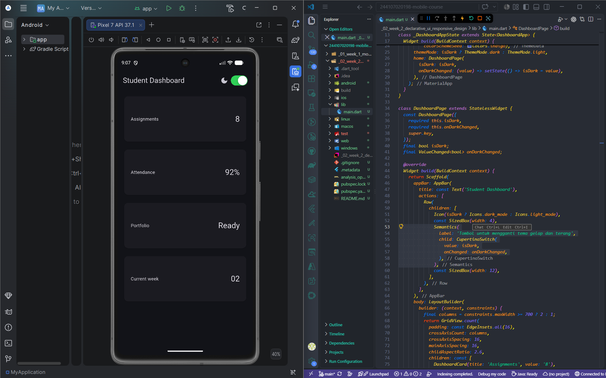
    ```dart
    Semantics(
      label: 'Tombol untuk mengganti tema gelap dan terang',
      child: CupertinoSwitch(
        value: isDark,
        onChanged: onDarkChanged,
      ),
    )
    

---

## 3. Tugas Utama: Academic Overview
Untuk tugas utama, saya mengembangkan dashboard dasar tadi menjadi halaman "Academic Overview" yang memuat data profil saya dan 4 kartu info akademik. Beberapa hal yang sudah diterapkan:
*   Membuat header profil dan empat kartu informasi menggunakan kombinasi `Row`, `Column`, `Expanded`, dan `Container`.
*   Layout sudah responsif (1 kolom di layar HP, 2 kolom di layar tablet/lebar).
*   Ada fitur ganti tema (terang/gelap) pakai `ThemeMode` yang warnanya otomatis menyesuaikan agar tetap terbaca.
*   Menambahkan `Semantics` di tombol switch dan kartu info agar mendukung aksesibilitas (*Screen Reader*).

### Screenshot Hasil:
**Tampilan Layar Sempit (Mobile - 1 Kolom):**
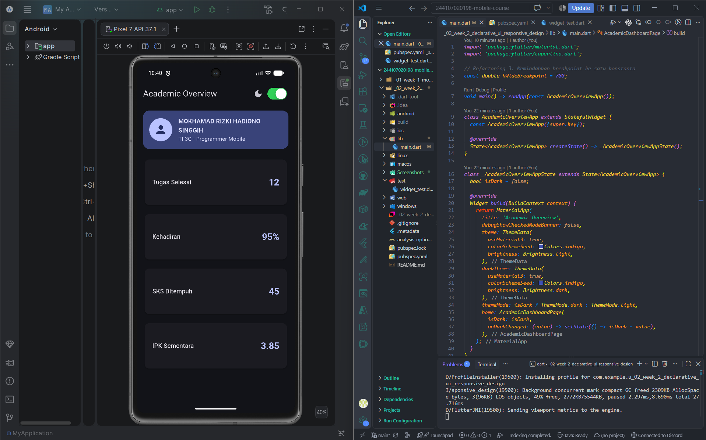

**Tampilan Layar Lebar (Tablet/Web - 2 Kolom):**
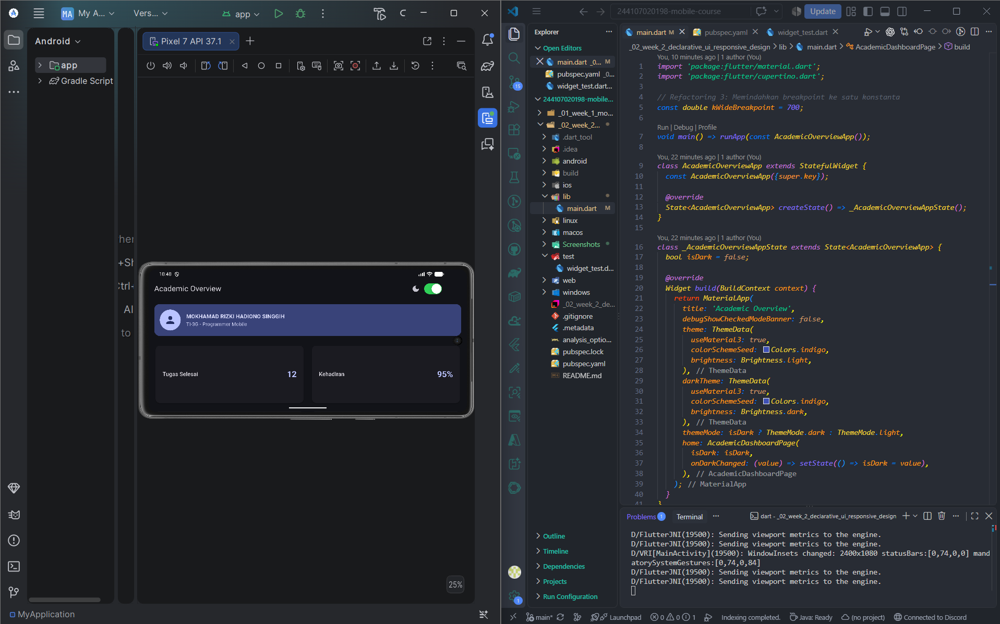

---

## 4. AI Prompt Challenge
Bagian ini berisi dokumentasi diskusi saya dengan AI untuk membahas keputusan desain dan pemahaman konsep kode:

**A. Prompt Desain**
*   **Prompt saya:** "Bandingkan dua tata letak dashboard akademik untuk Flutter: versi GridView dan versi LayoutBuilder + Column. Jelaskan trade-off responsif dan aksesibilitasnya."
*   **Jawaban AI:** `GridView` sangat praktis untuk mengatur jumlah kolom dan jaraknya rapi secara otomatis, tapi ukuran rasionya kaku. Kalau teks kepanjangan, gampang kepotong (*overflow*). Kalau pakai `LayoutBuilder + Column`, tinggi kartu lebih fleksibel mengikuti isi teks, tapi pengaturan jaraknya (*spacing*) harus diatur lebih manual.
*   **Keputusan:** Saya memilih gabungan `LayoutBuilder` dan `GridView` (dengan mengatur `childAspectRatio`). Alasannya, isi teks di kartu ini statis dan pendek (hanya angka dan label), sehingga lebih cocok menggunakan tampilan kotak yang rapi dan seragam.

**B. Prompt Penguatan Konsep**
*   **Prompt saya:** "Jelaskan kapan penggunaan Expanded justru menyebabkan overflow atau error di dalam Row, beri contoh kode yang gagal dan perbaikannya."
*   **Jawaban AI:** `Expanded` akan menyebabkan error (*RenderFlex Exception*) kalau diletakkan di dalam wadah yang lebarnya tidak terbatas (*unbounded constraints*), contohnya di dalam `SingleChildScrollView` yang di-scroll horizontal. Widget-nya akan bingung harus merentang sampai mana.
*   **Perbaikannya:** Hapus `Expanded` jika ada di dalam area *scroll* horizontal, atau bungkus dengan container yang ukuran lebarnya sudah pasti.

**C. Verification Prompt**
*   **Prompt saya:** "Periksa kembali rekomendasi layout di atas: apakah tetap responsif di bawah 600px, apakah mengurangi aksesibilitas, dan apakah ada widget yang tidak tersedia di Flutter stabil saat ini?"
*   **Jawaban AI:** Lolos audit. Untuk layar di bawah 600px dipastikan aman karena kondisinya diatur menjadi 1 kolom jika layar `< 700px`. Aksesibilitas justru meningkat berkat penggunaan `Semantics`. Semua widget juga terkonfirmasi *stable* di Flutter Material 3.

---

## 5. Refactoring Challenge & Testing
Setelah kode berhasil berjalan, saya melakukan optimasi (*refactoring*) agar kode lebih rapi dan bersih:
1. Kartu informasi dipisah menjadi widget *reusable* dengan nama `InfoCard`.
2. Warna yang tadinya ditulis manual (*hardcode*) diganti menggunakan `Theme.of(context)` agar otomatis menyesuaikan dengan tema gelap/terang.
3. Batas layar lebar diekstrak menjadi variabel konstan `const double kWideBreakpoint = 700;`.
4. Kode lolos uji *linting* (muncul pesan "No issues found!" saat menjalankan `flutter analyze`).
5. Sudah membuat *widget test* yang lolos pengujian untuk memverifikasi responsivitas 1 kolom dan 2 kolom (`flutter test`).

**Bukti Uji (Testing & Analyze):**

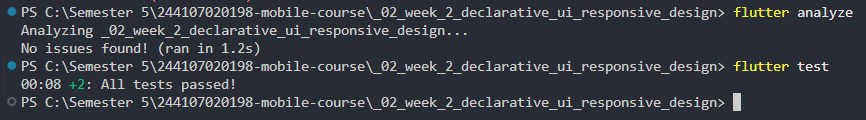

---

## 6. Refleksi

1. **Perbedaan imperative vs declarative UI:** 
   Pada pendekatan *imperative* (seperti cara lama), kita harus menulis instruksi langkah demi langkah secara manual untuk memanipulasi elemen UI (misal: mencari ID teks lalu mengubah warnanya). Di pendekatan *declarative* (seperti Flutter), kita cukup mendeskripsikan kondisi akhir UI berdasarkan *state* saat ini. Jika *state*-nya berubah, Flutter otomatis akan menggambar ulang (*rebuild*) UI tersebut.

2. **Kapan Expanded membantu dan bikin error:**
   `Expanded` sangat membantu jika kita ingin mengisi sisa ruang kosong secara otomatis di dalam `Row` atau `Column` yang ukuran maksimalnya sudah pasti. Namun, `Expanded` akan menyebabkan error kalau dimasukkan ke dalam wadah yang tidak punya batas ukuran akhir (*unbounded*), seperti di dalam `ListView` atau `SingleChildScrollView`.

3. **Pengaruh Breakpoint & Theme:**
   *Breakpoint* memastikan UI tetap nyaman dipakai di ukuran layar apa saja—tidak terpotong di HP, dan tidak terlihat kosong di layar tablet/desktop. Sedangkan *Theme* (khususnya *dark mode*) sangat berpengaruh pada kenyamanan mata pengguna dan menjaga konsistensi warna aplikasi di berbagai kondisi cahaya.

4. **Verifikasi AI:**
   Saya memastikan bahwa kode yang disarankan AI benar-benar bisa dijalankan (*compile*) tanpa error, menguji langsung perubahan tata letaknya dengan me-resize jendela aplikasi, mengecek fungsi *screen reader* pada widget aksesibilitasnya, serta memastikan kebersihan kodenya lewat *tools* bawaan Flutter (`flutter analyze`).