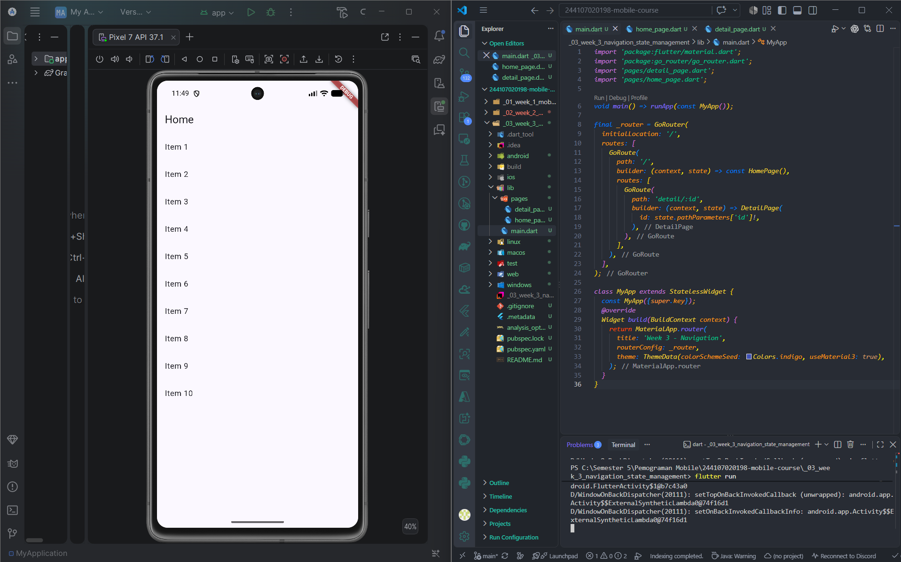
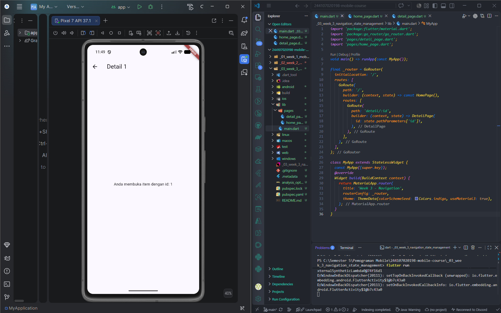
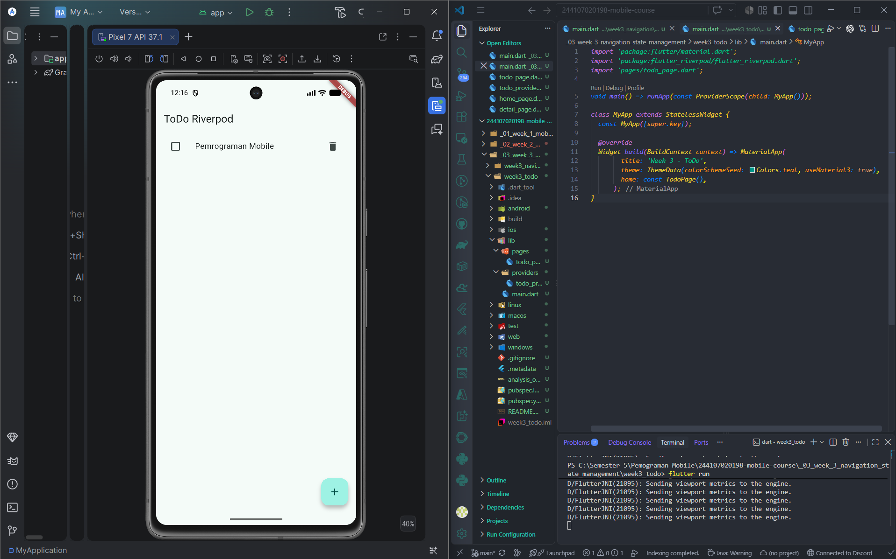
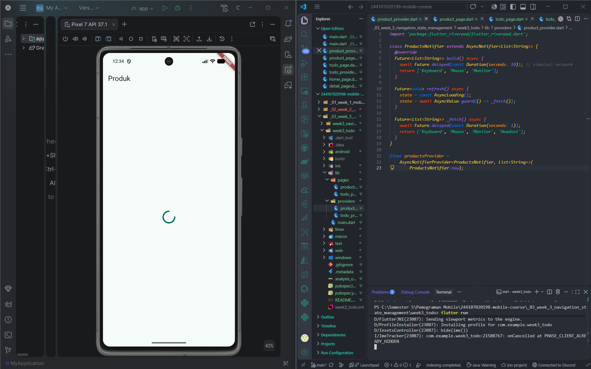
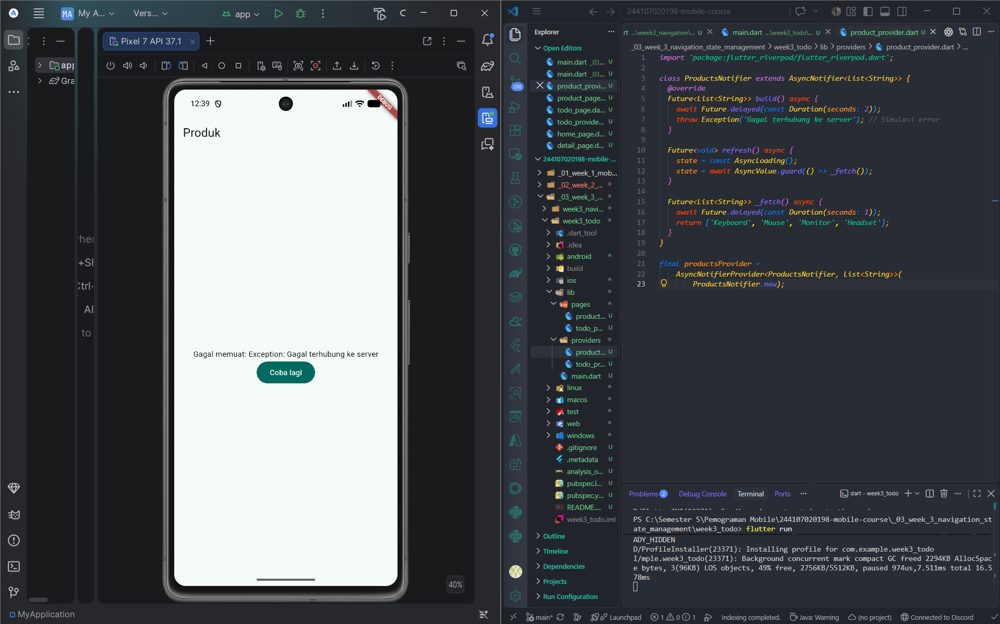
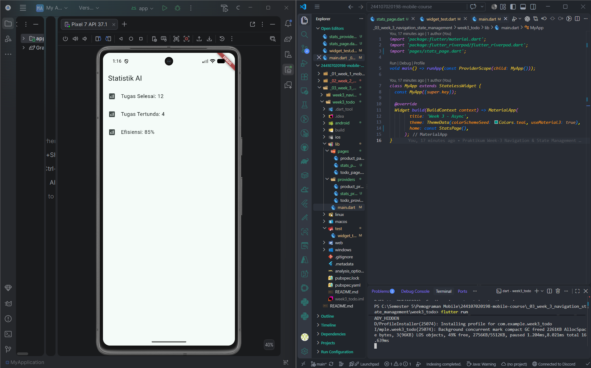
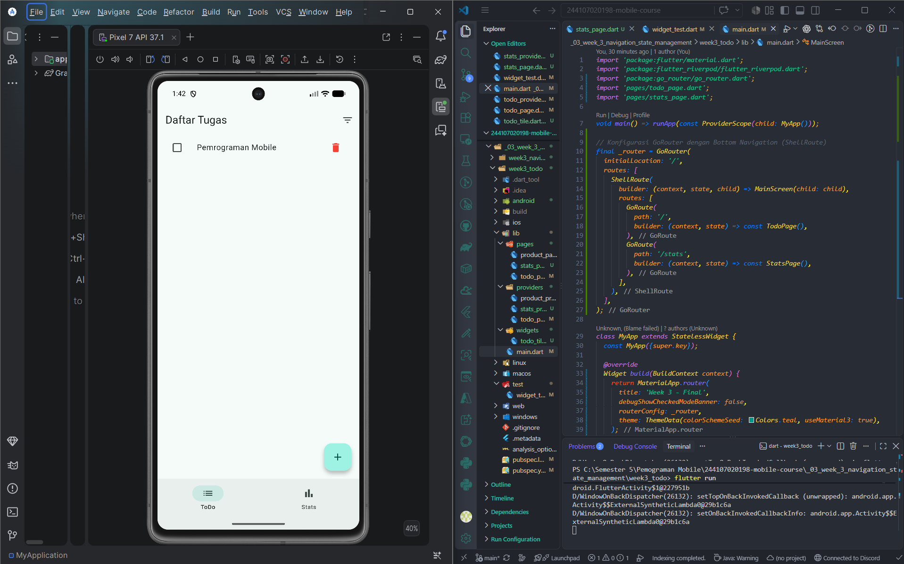
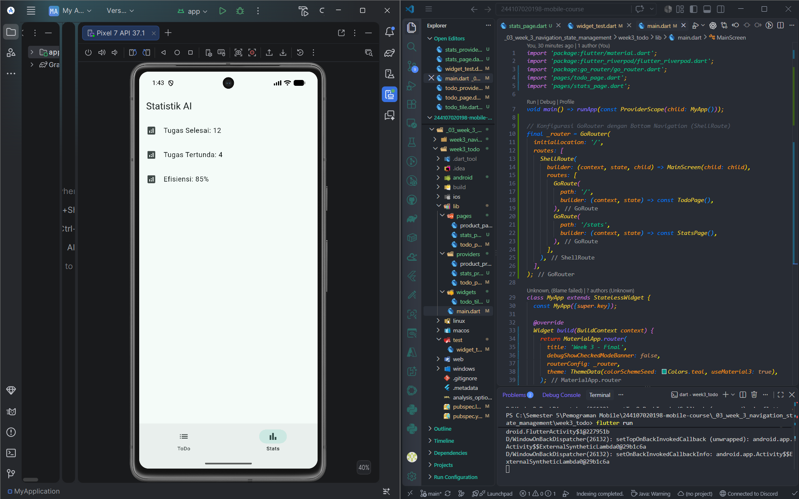
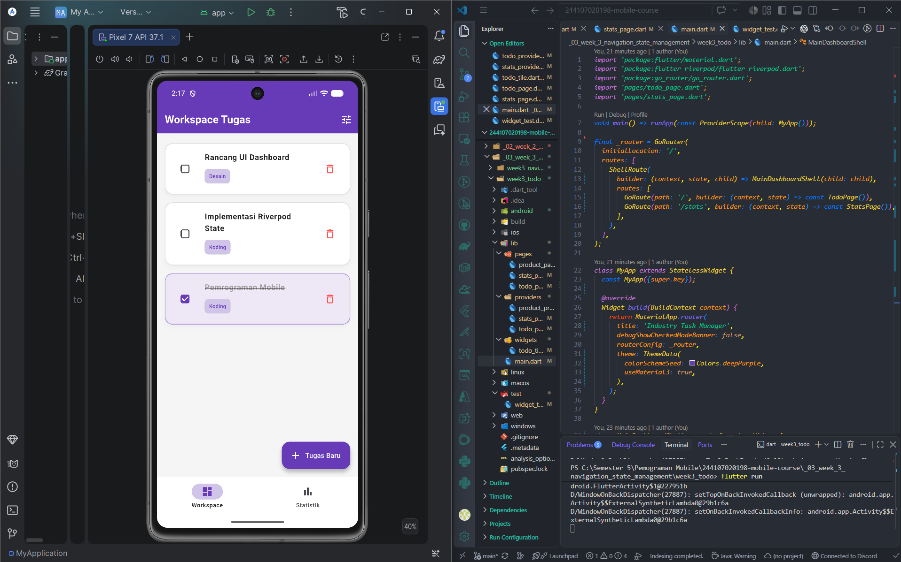
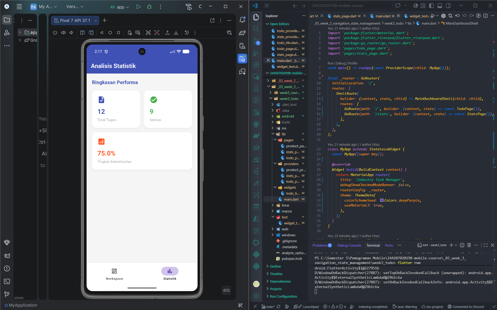

# Laporan Praktikum Week 3: Navigation & State Management

**Nama:** MOKHAMAD RIZKI HADIONO SINGGIH
**NIM:** 244107020198
**Kelas:** TI-3G - Pemrograman Mobile

---

## 1. Praktikum 1: Aplikasi Multi-Page dengan GoRouter
Di praktikum pertama ini, saya mencoba mengatur navigasi halaman menggunakan *package* `go_router`. Bedanya dengan cara bawaan Flutter (Navigator 1.0), `go_router` menggunakan sistem *URL path*, jadi lebih mudah kalau mau mengatur alur rute atau membuat *deep linking*.

* **Halaman Home:** Menampilkan daftar item menggunakan `ListView.builder`. Kalau salah satu item ditekan, aplikasinya akan pindah halaman dengan perintah `context.go('/detail/${index + 1}')`.

* **Halaman Detail:** Halaman ini menangkap parameter `id` dari URL untuk ditampilkan. Karena alur rutenya sudah tersusun jelas, tombol *back* bawaan di AppBar langsung berfungsi secara otomatis tanpa perlu dikonfigurasi manual.

---

## 2. Praktikum 2: Aplikasi ToDo dengan Riverpod
Lanjut ke praktikum kedua, fokusnya adalah memisahkan logika data dengan tampilan antarmuka (UI) menggunakan `flutter_riverpod`. Konsep utamanya adalah *immutability*, yaitu kita tidak boleh mengubah data secara langsung.

* **Bungkus Aplikasi:** Fungsi `runApp` di `main.dart` dibungkus dengan `ProviderScope` supaya semua widget di dalamnya bisa membaca *state* (data) dari Riverpod.
* **Bikin Provider:** Saya membuat kelas `TodoListNotifier` untuk mengelola list tugas. Di sini ada fungsi untuk menambah, mengubah status selesai (*toggle*), dan menghapus tugas. Setiap ada perubahan, saya membuat salinan list baru alih-alih mengubah isi list yang lama agar UI otomatis nge-*refresh*.
* **Nampilin ke UI:** Pada file `todo_page.dart`, saya memakai `ConsumerWidget`. Datanya dipantau pakai `ref.watch()`, sehingga kalau ada perubahan, layarnya langsung *update* sendiri. Untuk menjalankan fungsinya tanpa memantau terus-menerus (misalnya saat tombol diklik), saya memakai `ref.read()`.

---

## 3. Praktikum 3: Uji Ketiga State (Simulasi AsyncValue)
Di praktikum ketiga ini, saya melakukan pengujian langsung terhadap tiga kondisi saat aplikasi mengambil data dari server menggunakan `AsyncValue`.

* **Uji State Loading:** Saat aplikasi pertama kali dijalankan, saya mengamati layar menampilkan indikator *loading* (berputar) dengan lancar selama 2 detik pertama berkat jeda buatan yang ditambahkan.

* **Uji State Error:** Saya sengaja menyabotase fungsinya dengan menambahkan `throw Exception('Gagal terhubung ke server');` di dalam `build()`. Hasilnya, layarnya langsung merespons dengan menampilkan UI pesan *error* dan tombol "Coba lagi", alih-alih cuma nge-blank putih.

* **Uji State Success & Pemulihan:** Waktu tombol "Coba lagi" diklik, perintah `ref.invalidate` berhasil memaksa provider untuk melakukan *refresh* (dijalankan ulang dari awal). Setelah kode sabotase tadi saya hapus, datanya berhasil dimuat dan state *success* tampil dengan benar.

---

## 4. AI Prompt Challenge
Selama mengerjakan tugas ini, saya sempat berdiskusi dengan AI untuk mencari solusi arsitektur dan ide desain. Berikut ringkasannya:

**A. Diskusi Konsep Asinkron**
* **Prompt saya:** "Buatkan halaman Flutter bernama StatsPage menggunakan flutter_riverpod dengan syarat: ConsumerWidget, menggunakan satu AsyncNotifierProvider yang mensimulasikan data statistik (delay 2 detik, gagal 30%), menangani state loading, error dengan tombol retry, dan success."
* **Hasilnya:** AI memberikan kode yang sudah berfungsi dengan baik menggunakan `AsyncNotifier` modern. 
* **Keputusan/Perbaikan:** Kodenya saya pecah agar lebih rapi. File provider saya pindahkan ke folder khusus `lib/providers/`, dan tampilan halamannya ke `lib/pages/`.

**B. Diskusi Desain Antarmuka**
* **Prompt saya:** "Ubah desain project ToDo ini agar tampilannya tidak standar. Gunakan tema Deep Purple, format kartu modern (Dashboard Cards) untuk halamannya, dan pisahkan item list menjadi widget mandiri."
* **Hasilnya:** AI membantu merombak tema warna dasarnya dan memberikan ide desain menggunakan *box shadow* agar kartunya terlihat melayang.

---

## 5. Refactoring Challenge & Testing
Setelah semua fitur berjalan, kodenya saya rapikan lagi dan diuji untuk memastikan tidak ada celah *bug*:
1. **Modularisasi Kode:** Memisahkan *widget* item tugas menjadi komponen mandiri `TodoCardTile` (disimpan di `lib/widgets/todo_tile.dart`).
2. **Cek Kebersihan Kode (Linting):** Menjalankan perintah `flutter analyze` di terminal. Hasilnya bersih, tidak ada peringatan atau teguran.
3. **Automated Testing:** Membuat *widget test* di file `test/widget_test.dart` untuk mencoba interaksi klik tombol tambah, mengetik judul tugas, hingga tugasnya muncul di layar. Saat dijalankan dengan `flutter test`, semuanya lolos 100%.

---

## 6. Tugas Utama: Industry Challenge (Workspace & Dashboard)
Untuk tugas mandiri, saya menggabungkan GoRouter dan Riverpod tadi untuk membangun aplikasi manajemen tugas yang lebih lengkap. Ada dua halaman utama, fitur filter data, dan simulasi pengambilan data dari server.

* **Navigasi Tab (ShellRoute):** Saya memanfaatkan fitur `ShellRoute` dari GoRouter. Tujuannya supaya *Bottom Navigation Bar* di bawah tetap menempel di posisinya saat saya berpindah-pindah tab antara halaman Workspace (`/`) dan Statistik (`/stats`).
* **Fitur Filter:** State pada Riverpod saya tambahkan fitur filter (Semua, Desain, Koding) menggunakan *derived provider* agar list tugasnya bisa disortir secara instan.
* **Desain Baru:** Agar tidak kaku, tampilannya saya rombak total menjadi tema **Deep Purple** dengan format kartu modern (*Dashboard Cards*). Bagian input tugas barunya juga saya ubah menggunakan *bottom sheet* yang muncul dari bawah layar.

### Screenshot Hasil:
**Tampilan Halaman Workspace (ToDo):**

**Tampilan Halaman Statistik Dashboard:**

---

## 7. Refleksi

1. **Kapan pakai `setState` dan kapan harus pindah ke Riverpod?**
   Kalau datanya cuma dipakai sementara di satu halaman itu saja (misalnya input teks yang sedang diketik), `setState` sudah cukup. Tapi kalau datanya dipakai bersama-sama di banyak halaman (seperti daftar tugas), lebih baik langsung memakai Riverpod.

2. **Apa bedanya `context.go` dan `context.push`?**
   `context.go` mengganti struktur navigasi saat itu juga (cocok dipakai untuk menu tab bawah yang setara). Sedangkan `context.push` fungsinya menumpuk rute baru di atas halaman sebelumnya, sehingga tombol "Back" bakal otomatis muncul.

3. **Kenapa `AsyncValue` lebih aman buat data server?**
   Kondisinya mutlak diatur oleh sistem: lagi *loading*, sukses mendapat data, atau terjadi *error*. Kodenya jadi lebih bersih dan minim *error* (seperti halaman nge-blank) karena kita wajib memanggil fungsi `.when()` untuk menangani ketiga kondisinya.

4. **Kenapa menampilkan ulang data lama (stale data) kadang lebih baik daripada mengosongkan layar saat *refresh*? Kapan pola ini penting?**
   Menampilkan data lama (stale data) sambil memunculkan indikator *loading* kecil (seperti efek *pull-to-refresh*) jauh lebih bagus untuk kenyamanan pengguna (UX). Kalau layar tiba-tiba dikosongkan jadi putih setiap kali memuat ulang data, rasanya sangat mengganggu dan tidak mulus. Pola ini sangat penting di aplikasi yang sering di-*update* (seperti *feed* sosial media atau berita), supaya pengguna masih punya bahan bacaan di layar sambil menunggu koneksi yang mungkin agak lambat menyegarkan data barunya.