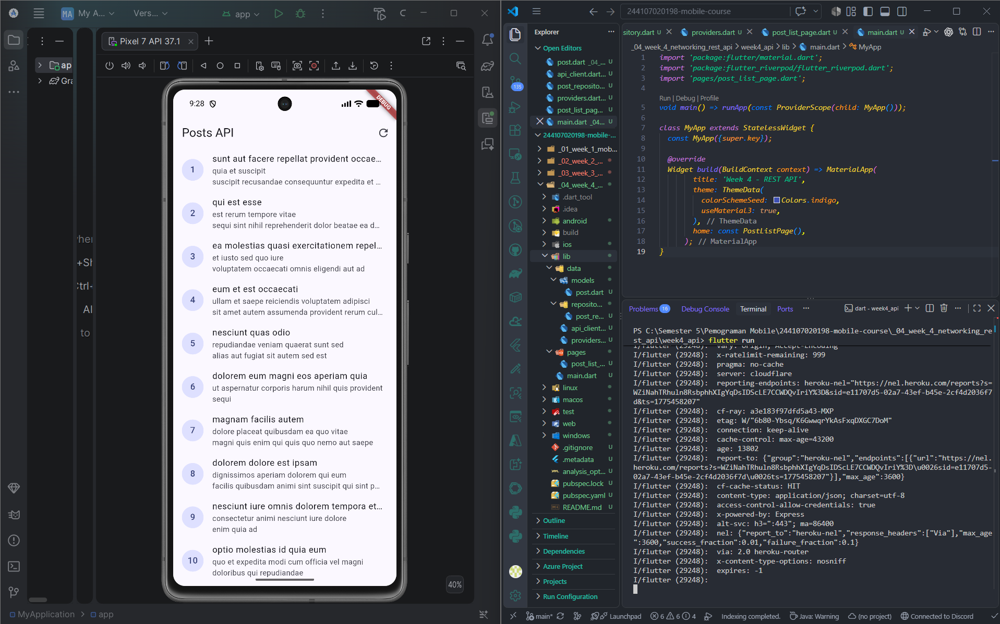
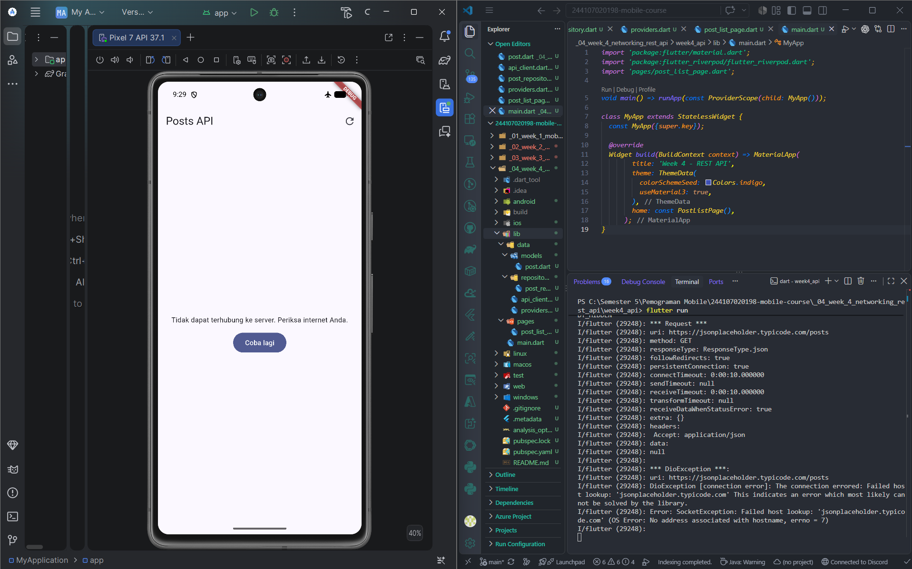
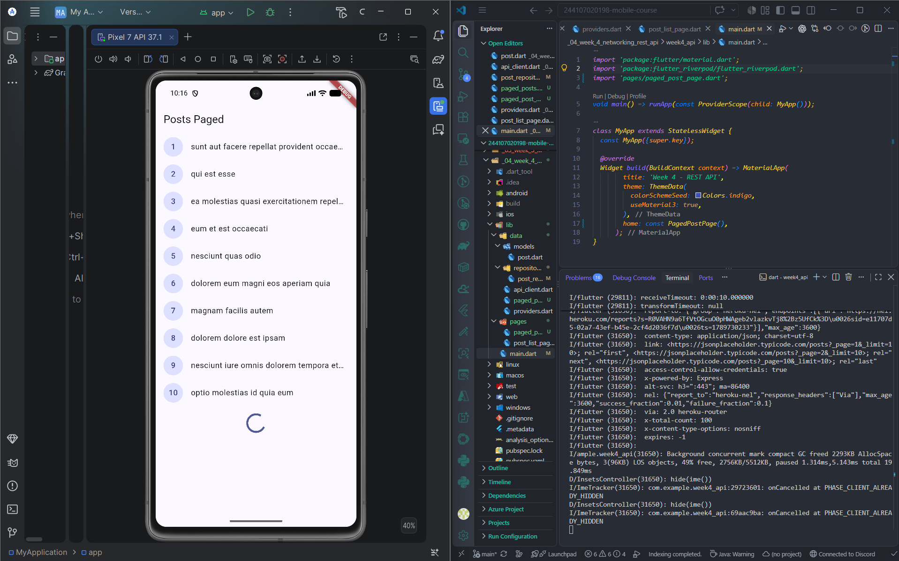
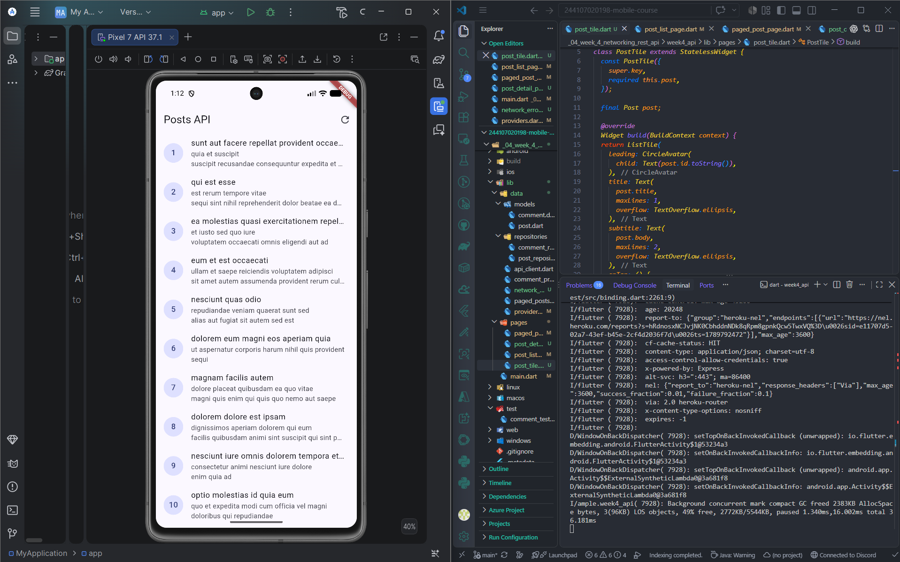
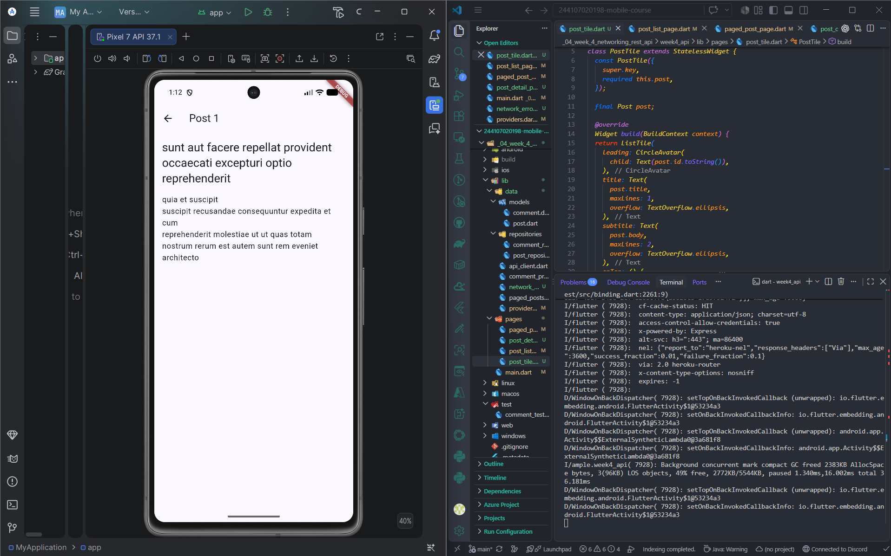
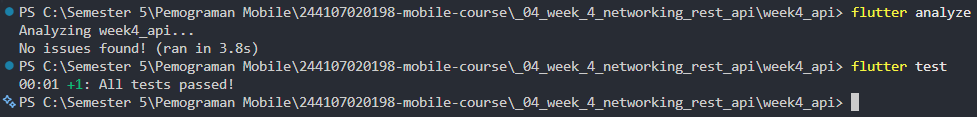
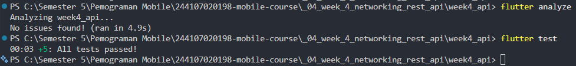
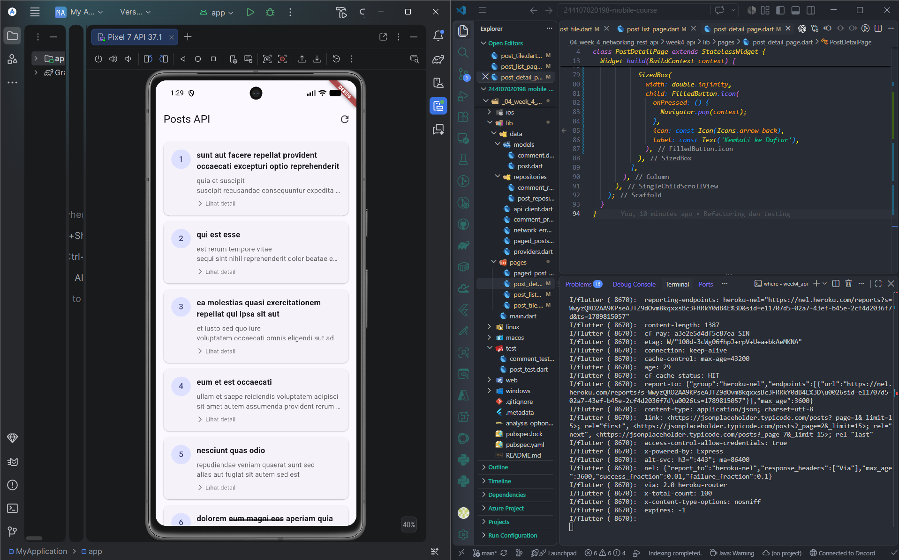
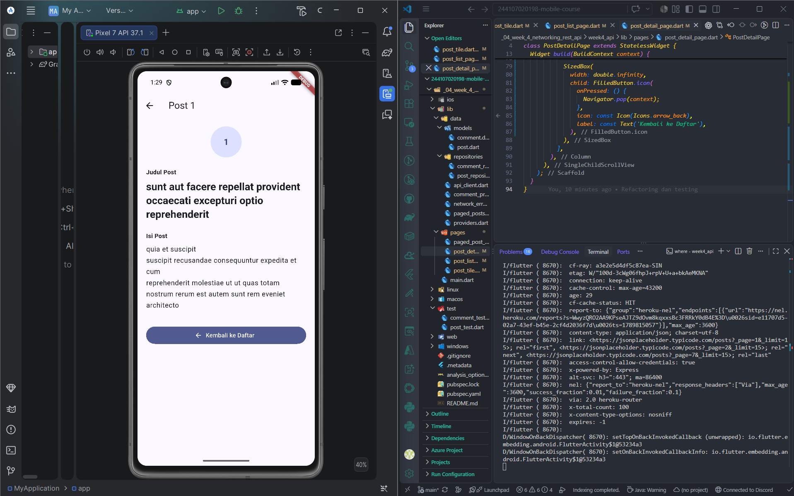

# Laporan Praktikum Week 4: Networking & REST API

**Nama:** MOKHAMAD RIZKI HADIONO SINGGIH
**NIM:** 244107020198
**Kelas:** TI-3G - Pemrograman Mobile

---

## 1. Praktikum 1: Dio dan Model Data

* **Konfigurasi Dio:** Membuat konfigurasi Dio secara terpusat di file `api_client.dart`. Di dalamnya terdapat *base URL*, *timeout* selama 10 detik, *header*, dan `LogInterceptor` untuk membantu melihat proses request.
* **Model Post:** Membuat model `Post` yang memiliki data `userId`, `id`, `title`, dan `body`. Method `fromJson` dibuat aman terhadap data `null` dengan memberikan nilai default jika field tidak tersedia.
* **Repository:** Pengambilan data API tidak dilakukan langsung dari UI. Saya membuat `PostRepository` sebagai perantara antara aplikasi dan API. Dengan cara ini, UI hanya menggunakan data yang sudah disediakan oleh repository.

Alur pengambilan data pada project ini adalah:

UI → Riverpod → Repository → Dio → REST API

---

## 2. Praktikum 2: Riverpod dan Penanganan State

* **Bungkus Aplikasi:** Fungsi `runApp` di `main.dart` dibungkus dengan `ProviderScope` supaya semua widget di dalam aplikasi dapat menggunakan state dari Riverpod.
* **Bikin Provider:** Saya membuat `dioProvider` untuk menyediakan instance `Dio` dan `postRepositoryProvider` untuk menyediakan `PostRepository`. Dengan begitu, konfigurasi komunikasi dengan API tetap berada pada bagian data dan tidak langsung dilakukan oleh UI.
* **AsyncNotifier:** Saya menggunakan `PostListNotifier` yang mewarisi `AsyncNotifier`. Provider ini digunakan untuk mengambil data dari repository dan mengelola kondisi asynchronous seperti loading, error, dan data berhasil.
* **Nampilin ke UI:** Pada halaman `post_list_page.dart`, data dipantau menggunakan `ref.watch()`. State kemudian ditampilkan sesuai kondisinya sehingga aplikasi dapat menampilkan loading, pesan error, atau daftar data dari API.

* **Uji State Loading:** Saat aplikasi pertama kali mengambil data dari REST API, aplikasi menampilkan indikator *loading* sebelum data berhasil ditampilkan.

* **Uji State Error:** Saya mematikan koneksi internet kemudian melakukan *refresh*. Aplikasi menampilkan pesan error yang mudah dipahami pengguna dan menyediakan tombol **"Coba lagi"**.

* **Uji Pemulihan:** Setelah koneksi internet kembali aktif, tombol **"Coba lagi"** digunakan untuk mengambil data kembali. Data berhasil ditampilkan seperti sebelumnya.

---

## 3. Praktikum 3: Pagination dan Infinite Scroll

* **Pagination:** Data diambil secara bertahap menggunakan parameter `_page` dan `_limit`. Pada project ini digunakan **15 data setiap halaman** karena di saya jika mengambil 10 akan terjadi error.
* **Infinite Scroll:** Menggunakan `ScrollController` untuk mendeteksi ketika pengguna sudah mendekati bagian bawah daftar. Ketika kondisi tersebut tercapai, aplikasi akan mengambil halaman berikutnya secara otomatis.
* **Guard Request:** Untuk mencegah request ganda, saya menggunakan kondisi `isLoadingMore`. Jika request halaman sebelumnya masih berjalan, request berikutnya tidak akan dijalankan.

Contoh alur pagination:

Halaman 1 → 15 data  
↓  
Scroll ke bawah  
↓  
Halaman 2 → 15 data  
↓  
Scroll ke bawah  
↓  
Halaman 3 → 15 data

* **Loading Pagination:** Ketika halaman berikutnya sedang dimuat, aplikasi menampilkan indikator *loading* di bagian bawah daftar.

---

## 4. Pengembangan UI dan Detail Post

* **Post Tile:** Data setiap post ditampilkan menggunakan widget `PostTile`. Setiap data dibuat dalam bentuk Card yang menampilkan ID, judul, isi singkat, dan pilihan untuk melihat detail.

* **Halaman Detail:** Ketika salah satu post ditekan, aplikasi berpindah ke halaman detail menggunakan `GoRouter`. Halaman tersebut menampilkan ID, judul lengkap, dan isi lengkap dari post.

* **Tombol Kembali:** Pada halaman detail terdapat tombol untuk kembali ke daftar post.

---

## 5. AI Prompt Challenge

**Prompt saya:**

> "Buatkan repository layer Flutter untuk endpoint GET /comments?postId={id} dari JSONPlaceholder menggunakan Dio + flutter_riverpod.
>
> Requirements:
> - Model Comment dengan fromJson aman null (postId, id, name, email, body).
> - CommentRepository dengan method fetchComments(postId) + timeout 10 detik.
> - AsyncNotifierProvider dengan penanganan error otomatis (AsyncError) dan fungsi pesan error ramah pengguna untuk timeout, connection error, 404, dan 500.
> - Satu unit test untuk fromJson dengan field yang hilang.
> - Jelaskan setiap bagian kode dalam komentar."

* **Hasilnya:** AI memberikan model `Comment`, `CommentRepository`, `CommentsNotifier`, provider asynchronous, fungsi pesan error, dan unit test untuk `Comment.fromJson`.
* **Perbaikan Provider:** Hasil provider dari AI saya sesuaikan menggunakan `AsyncNotifierProvider` agar sesuai dengan struktur project yang digunakan.
* **Perbaikan Testing:** Test bawaan Flutter yang masih menggunakan pengujian aplikasi Counter dihapus karena tidak sesuai dengan project REST API. Saya kemudian menggunakan `FakePostRepository` untuk melakukan testing provider tanpa melakukan request langsung ke internet.
* **Pengujian Error:** Menambahkan pengujian `DioException` untuk memastikan error dari repository dapat ditangani oleh provider.
* **Pengujian Model:** Membuat unit test untuk memastikan `Comment.fromJson` tetap aman ketika beberapa field JSON tidak tersedia.

Dokumentasi AI berisi prompt, hasil awal AI, dan dokumentasi perbaikannya.

---

## 6. Refactoring Challenge & Testing

1. **Modularisasi Kode:** Memisahkan tampilan setiap data post menjadi widget mandiri `PostTile` yang disimpan di `lib/pages/post_tile.dart`. Dengan cara ini, kode pada halaman utama menjadi lebih rapi dan mudah dikelola.
2. **Pemisahan Error Handling:** Fungsi `friendlyErrorMessage` dipindahkan ke file `lib/data/network_errors.dart` agar kode penanganan error tidak bercampur dengan kode UI.
3. **Routing Detail:** Menambahkan `GoRouter` dengan route `/post/:id` untuk membuka halaman detail ketika salah satu post ditekan.
4. **Cek Kebersihan Kode (Linting):** Menjalankan perintah `flutter analyze` di terminal untuk memeriksa apakah terdapat error atau masalah pada kode.
   Hasilnya bersih, tidak ada masalah pada kode.
5. **Automated Testing:** Menjalankan `flutter test` untuk menguji model, error mapping, dan provider menggunakan repository palsu. Seluruh test berhasil dijalankan.

   

---

## 7. Tugas Utama: Industry Challenge (REST API Posts)

Untuk tugas mandiri, saya menggabungkan Dio, Repository, Riverpod, pagination, dan GoRouter untuk membangun aplikasi daftar data dari REST API JSONPlaceholder.

* **Pengambilan Data:** Aplikasi mengambil data dari endpoint `/posts` menggunakan Dio melalui `PostRepository`. UI tidak melakukan request Dio secara langsung.
* **State Management:** Riverpod digunakan untuk mengelola proses asynchronous sehingga aplikasi dapat menangani beberapa kondisi, yaitu loading, error, empty, dan success.
* **Dio Terpusat:** Konfigurasi Dio dibuat di satu tempat dengan `baseUrl`, timeout 10 detik, header, dan `LogInterceptor`.
* **Model Aman:** Model `Post` menggunakan `fromJson` yang aman terhadap field yang bernilai `null` atau tidak tersedia.
* **Pagination:** Aplikasi menggunakan *infinite scroll* dengan **15 data setiap halaman**. Ketika pengguna melakukan scroll ke bagian bawah, halaman berikutnya akan dimuat secara otomatis.
* **Guard Request:** Aplikasi menggunakan `isLoadingMore` untuk mencegah request halaman berikutnya dijalankan secara bersamaan.
* **Error dan Retry:** Jika terjadi masalah koneksi, aplikasi menampilkan pesan error dan tombol **"Coba lagi"**.
* **Refresh:** Pengguna dapat melakukan refresh data melalui tombol refresh pada AppBar maupun dengan melakukan *pull-to-refresh*.
* **Detail Data:** Setiap post dapat ditekan untuk membuka halaman detail menggunakan `GoRouter`. Halaman detail menampilkan ID, judul lengkap, dan isi lengkap dari post.

### Screenshot Hasil:

**Tampilan Halaman Utama (REST API):**

**Tampilan Halaman Detail:**

---

## 8. Refleksi

1. **Mengapa UI dilarang memanggil Dio langsung? Apa yang rusak jika aturan ini dilanggar?**
   UI tidak memanggil Dio secara langsung karena proses pengambilan data API sudah ditangani oleh Repository. Dengan pemisahan ini, UI hanya bertugas menampilkan data dan mengatur interaksi pengguna. Jika UI memanggil Dio langsung, kode UI dan komunikasi API menjadi tercampur sehingga lebih sulit dirawat dan diuji.

2. **Kapan pagination client-side cukup, dan kapan harus mengandalkan pagination server (`_page`/`_limit`)?**
   Pagination client-side cukup jika jumlah data relatif sedikit dan seluruh data dapat diambil sekaligus. Sedangkan pagination server lebih cocok jika jumlah data besar karena data dapat diambil secara bertahap. Pada project ini saya menggunakan pagination server dengan `_page` dan `_limit` sebanyak 15 data setiap halaman.

3. **Bagaimana exception repository berubah menjadi `AsyncError` tanpa try/catch di setiap widget? Kapan try/catch eksplisit tetap dibutuhkan?**
   Pada `AsyncNotifier`, exception yang terjadi ketika `build()` menjalankan repository akan ditangani oleh Riverpod dan state otomatis menjadi `AsyncError`. Widget kemudian cukup menangani kondisi tersebut.
   Try/catch eksplisit tetap dibutuhkan ketika melakukan perubahan state secara manual, seperti pada fungsi `refresh()` atau `loadNextPage()`, karena pada bagian tersebut error perlu ditangkap agar state dapat diperbarui sesuai kondisi aplikasi.

4. **Bagian mana dari hasil AI yang Anda perbaiki, dan mengapa?**
   Bagian yang saya perbaiki adalah provider dan testing. Provider hasil AI saya sesuaikan menggunakan `AsyncNotifierProvider` agar sesuai dengan struktur project. Test bawaan Flutter yang masih menggunakan Counter juga saya hapus karena tidak sesuai dengan project REST API.
   Untuk pengujian provider, saya menggunakan `FakePostRepository` agar test tidak bergantung pada koneksi internet. Saya juga melakukan pengujian `DioException` dan `fromJson` dengan field yang hilang. Perbaikan tersebut dilakukan agar hasil AI dapat digunakan dan diuji sesuai dengan kebutuhan project.

---