# Laporan Praktikum Week 5: Local Storage & Offline-First

**Nama:** MOKHAMAD RIZKI HADIONO SINGGIH  
**NIM:** 244107020198  
**Kelas:** TI-3G - Pemrograman Mobile  

---

## 1. Praktikum 1: Penyimpanan Key-Value dengan SharedPreferences
Pada praktikum pertama ini, dilakukan implementasi *local storage* menggunakan `shared_preferences`. Metode ini sangat cocok untuk menyimpan data primitif yang sederhana.

* **Preferensi Tema:** Fitur untuk mengganti mode terang/gelap (*Light/Dark Mode*) telah dibuat. Status `isDarkMode` (boolean) disimpan ke dalam SharedPreferences sehingga saat aplikasi ditutup dan dibuka lagi, tema yang dipilih pengguna tetap bertahan.
* **Merekam Waktu Akses:** Selain tema, SharedPreferences juga dimanfaatkan untuk mencatat waktu terakhir aplikasi dibuka (`last_opened`) dalam format *String* (ISO8601), yang kemudian ditampilkan di halaman Pengaturan.

---

## 2. Praktikum 2: Database Relasional dengan sqflite
Pada praktikum kedua, diimplementasikan penyimpanan data yang lebih kompleks dan persisten menggunakan SQLite (`sqflite`).

* **Membuat Skema Database:** Tabel `notes` dibuat dengan kolom `id`, `title`, `body`, `updated_at`, dan `dirty`. Proses ini membutuhkan penulisan *raw query* SQL secara manual pada fungsi `onCreate`.
* **NoteRepository:** Logika interaksi ke database dipisahkan ke dalam *class* repository. Pada bagian ini, diimplementasikan operasi CRUD (Create, Read, Update, Delete) secara penuh. Sebagai contoh, saat menampilkan daftar catatan, ditambahkan perintah `orderBy: 'updated_at DESC'` agar catatan yang paling baru diedit selalu muncul paling atas.

---

## 3. Praktikum 3: Arsitektur Offline-First & Antrean Sync
Pada tahap ini, dilakukan penggabungan database lokal dengan konsep *Offline-First*. Intinya, aplikasi harus tetap bisa berfungsi 100% meskipun tidak ada koneksi internet.

* **Dirty Flag:** Setiap kali terdapat penambahan atau pengeditan catatan saat *offline*, data tersebut disimpan ke SQLite dan ditandai dengan `dirty = 1`.
* **Simulasi Offline:** `NotifierProvider` (Riverpod) digunakan untuk membuat *toggle* "Force Offline Mode". Saat mode ini aktif, aplikasi mensimulasikan keadaan tanpa internet. Ikon awan coret (merah/oranye) dan *badge* angka di AppBar akan muncul untuk menunjukkan berapa banyak catatan yang masuk dalam antrean *sync*.
* **Sinkronisasi (Sync):** Saat tombol "Sync Notes" ditekan (atau ditarik ke bawah), aplikasi akan mengeksekusi data yang memiliki status `dirty = 1` ke server secara *asynchronous*, lalu mereset nilai `dirty` menjadi 0.

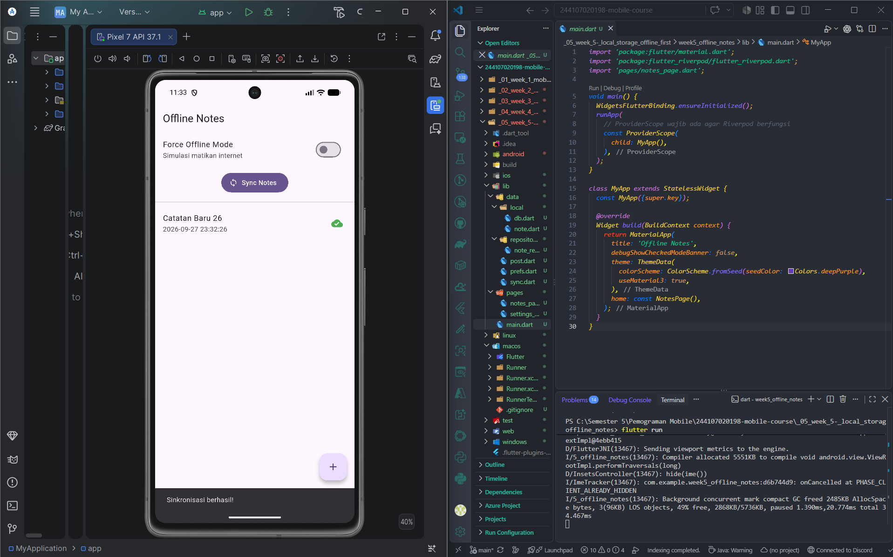  
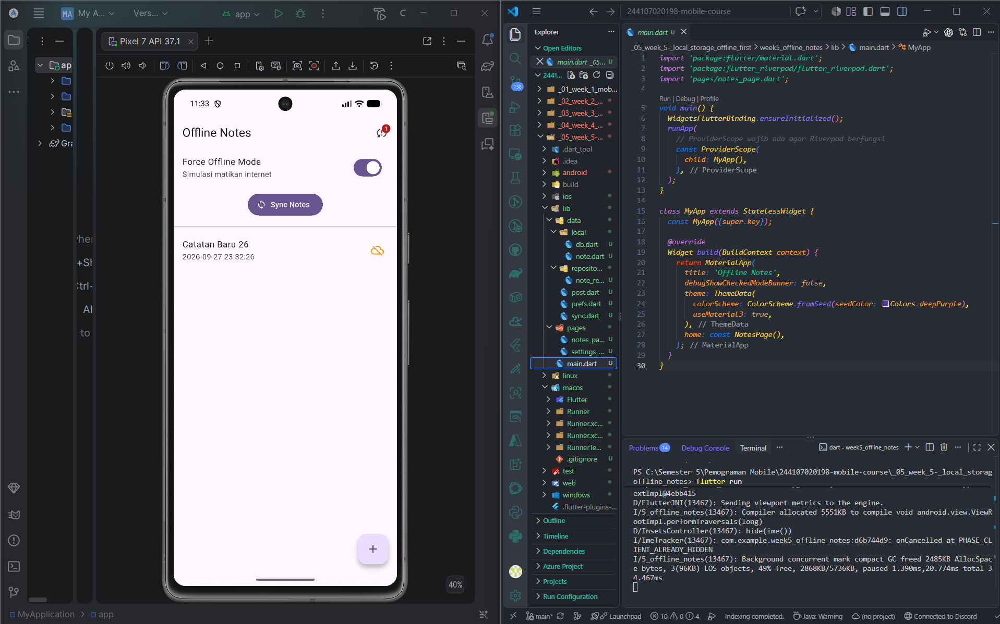

---

## 4. AI Challenge: Evaluasi Storage & Offline-First

Selama mengerjakan tugas ini, dilakukan verifikasi rekomendasi arsitektur penyimpanan menggunakan AI. Berikut ringkasannya:

### A. Diskusi Evaluasi Storage Engine
* **Prompt yang digunakan:** "Aplikasi Flutter Offline Notes: CRUD catatan + preferensi tema. Bandingkan SharedPreferences, Hive, sqflite, dan Drift... Beri rekomendasi final. Tunjukkan skema tabel untuk 1000+ catatan."
* **Hasil & Evaluasi:** 
  1. AI dengan tepat melarang penggunaan SharedPreferences untuk menyimpan 1000+ catatan karena boros RAM dan rentan *lag*.
  2. AI merekomendasikan **SharedPreferences untuk tema** dan **sqflite untuk catatan**. Rekomendasi ini diterima karena efisien dan minim *boilerplate* dibandingkan Drift/Hive.
  3. Namun, skema SQL murni dari AI **ditolak**. AI hanya memberikan skema CRUD polos (`id`, `title`, `body`). Skema tersebut dimodifikasi secara mandiri dengan menambahkan kolom `dirty` (sebagai penanda antrean sinkronisasi) dan `updated_at` (untuk aturan *Last-Write-Wins*).

### B. Output AI Assistant (Perbandingan Storage Flutter)

| Kriteria | SharedPreferences | Hive | sqflite (SQLite) | Drift |
| --- | --- | --- | --- | --- |
| **Kompleksitas Query** | Tidak ada. Hanya pencarian berbasis Key. | Terbatas. Harus memuat data ke memori untuk *filtering* kompleks. | Tinggi. Mendukung syntax SQL penuh (WHERE, ORDER BY, LIMIT). | Tinggi. Menggunakan DSL Dart yang di-compile ke SQL. |
| **Kebutuhan Relasi** | Tidak ada. | Manual dan sulit (menyimpan *key* dari *box* lain). | Didukung penuh melalui *Foreign Key* dan JOIN. | Didukung penuh dengan *type-safety* antar tabel. |
| **Reaktivitas (Stream)** | Tidak didukung secara native. | Didukung (melalui `ValueListenableBuilder`). | Tidak didukung secara native (harus manual). | Didukung penuh dan *auto-updating* secara native. |
| **Type-Safety** | Rendah (rentan *typo* pada String key/casting). | Tinggi (menggunakan *TypeAdapter* dan *code generation*). | Rendah (menggunakan `Map<String, dynamic>`). | Sangat Tinggi (*code generation* menghasilkan class Dart kuat). |
| **Ukuran Boilerplate** | Sangat kecil. | Sedang (butuh `build_runner` untuk model). | Sedang (menulis query raw SQL dan fungsi *mapping* manual). | Besar (butuh banyak *setup* awal dan `build_runner`). |
| **Kemudahan Testing** | Sangat mudah (tersedia `setMockInitialValues`). | Mudah (bisa membuka *box in-memory*). | Sulit (memerlukan *mocking* SQLite khusus seperti `sqflite_common_ffi`). | Mudah (mendukung *in-memory database* bawaan). |

**Rekomendasi Final & Alasan**

| Kebutuhan | Rekomendasi Storage | Alasan Utama |
| --- | --- | --- |
| **Preferensi Tema** | **SharedPreferences** | Tema (dark/light mode) murni berupa struktur data primitif tunggal (Key: `dark_mode`, Value: `true/false`). *Overkill* jika menggunakan database. |
| **CRUD Catatan** | **sqflite (SQLite)** | Untuk mengelola 1000+ catatan beserta antrean sinkronisasi, dibutuhkan eksekusi kueri agregat efisien (misal `SELECT COUNT(*) WHERE dirty = 1` atau mengurutkan berdasarkan tanggal terbaru). |

**Skema Tabel (sqflite) untuk 1000+ Catatan (Mendukung Sync Queue)**
CREATE TABLE notes ( id INTEGER PRIMARY KEY AUTOINCREMENT, title TEXT NOT NULL, body TEXT NOT NULL DEFAULT '', updated_at TEXT NOT NULL, dirty INTEGER NOT NULL DEFAULT 0 );

**Trade-off Setiap Pilihan:**
* **SharedPreferences:** Cepat diimplementasikan, tetapi memuat semua data ke memori (out-of-memory risk untuk 1000+ catatan).
* **Hive:** Sangat cepat untuk operasi baca/tulis (NoSQL), tetapi kurang efisien untuk filtering antrean data yang kompleks dibandingkan SQL.
* **sqflite:** Tangguh untuk struktur relasional dan jumlah baris besar, tetapi membutuhkan penulisan raw SQL yang rawan kesalahan sintaks dan tidak reaktif secara otomatis.
* **Drift:** Solusi terbaik untuk skala enterprise dengan reaktivitas penuh, namun membebani proyek kecil dengan ukuran boilerplate dan dependensi build_runner yang berat.

### C. AI Verification Checklist & Keputusan Final

* **Apakah AI menempatkan daftar catatan di SharedPreferences?**
  Tidak. AI dengan tepat memisahkan SharedPreferences (khusus tema) dan menolak menggunakannya untuk catatan karena risiko performa memori untuk 1000+ baris data.
* **Apakah skema AI mendukung antrean sync (dirty flag / updated_at) atau hanya CRUD polos?**
  Ya, skema yang diusulkan telah mencakup kolom `dirty` (INTEGER sebagai boolean SQLite) dan `updated_at` (TEXT untuk format ISO8601), sehingga antrean sync-offline dapat dijalankan dengan perintah `WHERE dirty = 1`.
* **Apakah klaim "real-time" AI didukung stream (Drift/watch) atau hanya asumsi?**
  Didukung. AI secara akurat mengidentifikasi bahwa Drift memiliki auto-updating streams bawaan, sementara sqflite tidak memilikinya tanpa perantara manual (seperti StreamController).
* **Apakah estimasi boilerplate AI masuk akal setelah percobaan instalasi?**
  Masuk akal. sqflite membutuhkan penulisan `Map<String, dynamic>` manual dan raw query, sedangkan solusi seperti Drift atau Hive mewajibkan penambahan paket build_runner yang memperlama waktu kompilasi saat development.

**Keputusan Final Penulis:**  
Berdasarkan perbandingan di atas, diputuskan untuk menggunakan kombinasi SharedPreferences dan sqflite (sesuai instruksi codelab).  
*Alasan Teknis:* SharedPreferences adalah solusi paling efisien dan tepat guna untuk key-value sederhana seperti dark_mode. Untuk data notes, sqflite dipilih karena kebutuhan antrean sync (offline-first) yang mengharuskan eksekusi kueri pencarian berdasarkan flag dirty = 1. Meskipun Drift menawarkan type-safety dan stream, penggunaannya untuk aplikasi catatan sederhana menambah kompleksitas struktur folder dan dependensi kompilasi (build_runner) yang belum krusial di tahap ini.

---

## 5. Refactoring Challenge & Testing
Setelah fitur penyimpanan dan sinkronisasi berjalan, struktur kode dirapikan dan diuji:

* **Refactoring UI:** Memisahkan tampilan list item menjadi widget NoteTile. Halaman NotesPage juga dirombak dengan menambahkan fitur RefreshIndicator (Tarik ke bawah untuk sync) dan merombak halaman detail menjadi form yang mendukung fungsi edit (Update) dan hapus (Delete).
* **Cek Kebersihan Kode:** Menjalankan `flutter analyze`. Beberapa warning terkait penggunaan syntax lama seperti withOpacity dan activeColor dibersihkan menjadi withValues dan activeThumbColor. Hasil akhir: No issues found!
* **Automated Testing:** Membuat pengujian di `test/note_test.dart` menggunakan FakeNoteRepository untuk mensimulasikan database tanpa perlu membuka SQLite sungguhan. Pengujian ini membuktikan pemetaan model data tahan terhadap data null dan Riverpod menangani state error dengan benar.

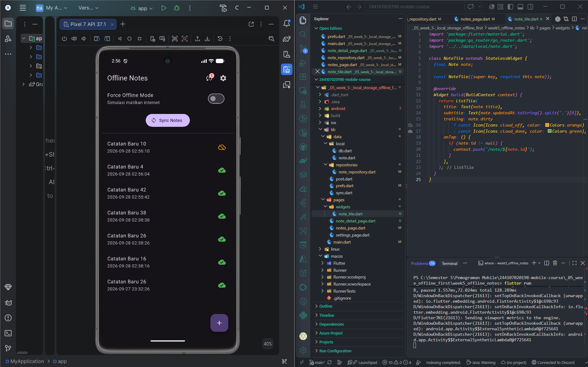
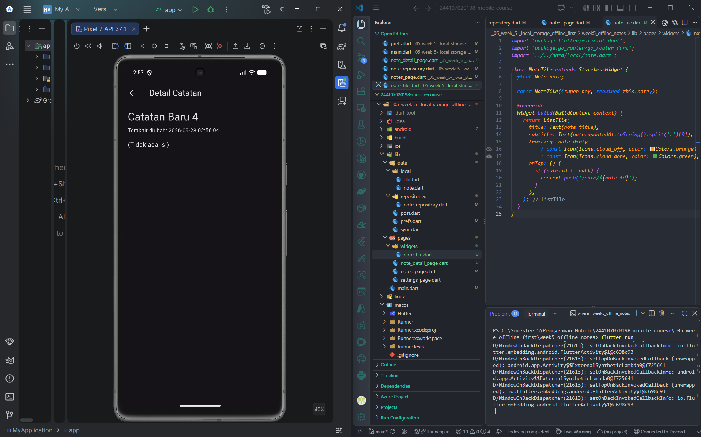
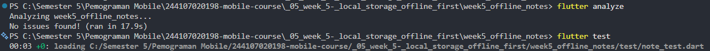
---

## 6. Tugas Utama: Industry Challenge (Offline Notes App)
Tugas akhir ini adalah penyempurnaan dari seluruh modul, menggabungkan arsitektur Riverpod, GoRouter, dan Local Storage menjadi aplikasi yang siap digunakan di "dunia nyata".

* **Resolusi Konflik:** Aplikasi telah menerapkan aturan konflik Last-Write-Wins secara implisit melalui penggunaan variabel timestamp (`updated_at`).
* **State Management yang Bersih:** Antarmuka aplikasi (UI) sama sekali tidak pernah memanggil SharedPreferences atau sqflite secara langsung. Semua komunikasi dijembatani secara bersih oleh provider Riverpod.
* **Interaksi Modern:** Penambahan form pembuatan catatan (Create) menggunakan Popup Dialog, konfirmasi penghapusan dengan Alert Dialog, serta penanganan cache halaman detail menggunakan perintah `ref.invalidate` agar perubahan data bisa langsung terlihat tanpa restart.

**Screenshot Hasil:**
* Tampilan Halaman Utama (Offline Mode Aktif & Antrean Sync):
  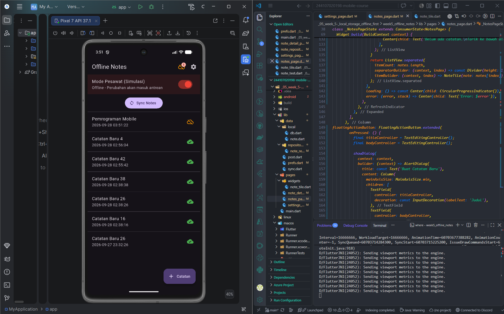
  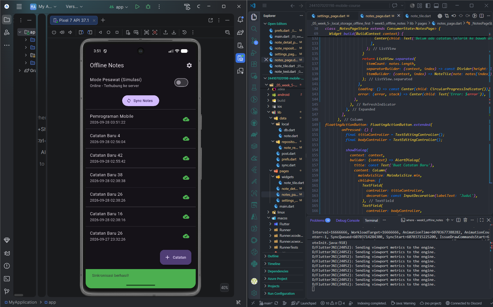
* Tampilan Dialog Buat Catatan Baru (Create):
  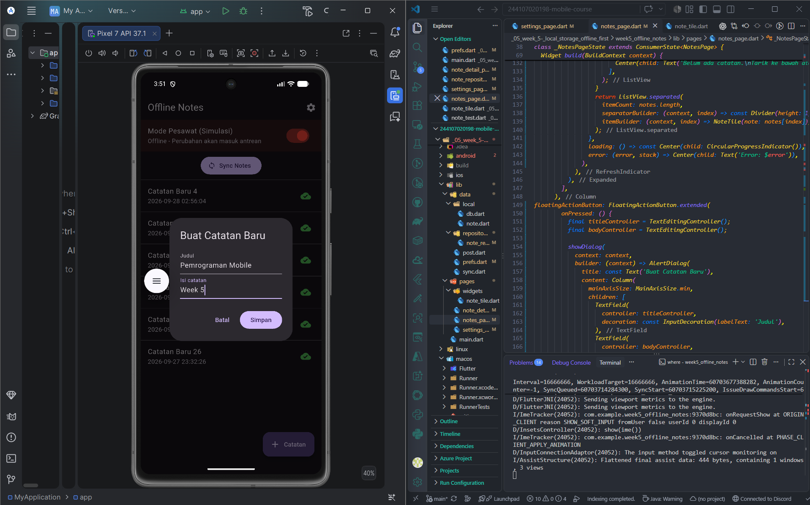
* Tampilan Halaman Detail / Edit Catatan (Update):
  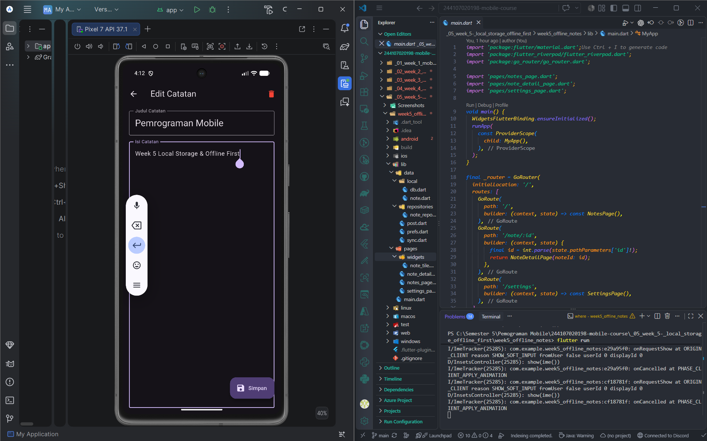
* Tampilan Dialog Konfirmasi Hapus (Delete):
  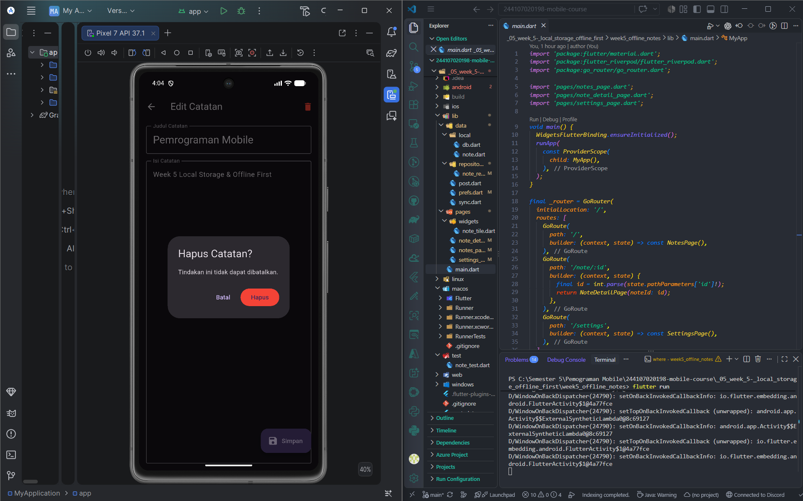
* Tampilan Halaman Pengaturan (Tema & Waktu Akses):
  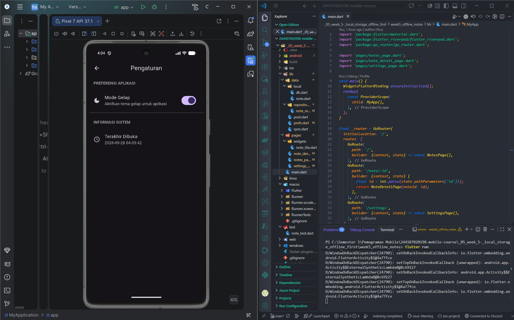

---

## 7. Refleksi

1. **Mengapa daftar catatan tidak boleh disimpan di SharedPreferences? Apa yang rusak jika aturan ini dilanggar?**
   Secara arsitektur, SharedPreferences dirancang murni untuk konfigurasi primitif (skalar). Jika 1000+ catatan disimpan, batas memori akan terlanggar karena SharedPreferences memuat seluruh berkas ke RAM sekaligus (sinkron) saat aplikasi dimulai. Jika dilanggar, aplikasi akan mengalami UI Freeze/Jank saat startup, kesulitan melakukan kueri pencarian, dan berisiko memicu Out of Memory (OOM) Crash.

2. **Kapan cache-first cukup, dan kapan membutuhkan strategi lain (misalnya network-first)?**
   Strategi Cache-first sangat cukup untuk data yang jarang berubah dan hanya bergantung pada satu pengguna (single-actor data), seperti preferensi lokal atau daftar catatan pribadi. Sebaliknya, Network-first wajib digunakan untuk data transaksional yang dibagikan (shared state), seperti harga kripto real-time atau sisa kursi tiket pesawat, di mana data lokal yang kedaluwarsa berpotensi menyebabkan kerugian fatal.

3. **Bagaimana dirty flag berubah menjadi antrean sync tanpa memblokir UI? Kapan antrean terpisah (tabel outbox) menjadi perlu?**
   Dirty flag berfungsi sebagai antrean menggunakan query spesifik (`WHERE dirty = 1`) yang dijalankan secara asynchronous di latar belakang sehingga UI Thread tidak terblokir. Namun, ketika urutan mutasi data sangat krusial (misal: "Catatan diubah, lalu dihapus saat masih offline"), akan dibutuhkan Tabel Outbox (Event Sourcing) agar urutan instruksi (ACTION_UPDATE, ACTION_DELETE) dapat dikirim berurutan ke server tanpa menimpa status akhirnya saja.

4. **Bagian mana dari rekomendasi AI yang ditolak, dan mengapa?**
   Usulan skema tabel database mentah dari AI (hanya id, title, content, created_at) ditolak. Meskipun benar secara sintaks, usulan ini gagal menangkap niat arsitektur offline-first. Skema tersebut dimodifikasi dengan menambahkan kolom dirty untuk melacak status sinkronisasi, dan updated_at untuk mendukung aturan resolusi konflik (LWW).